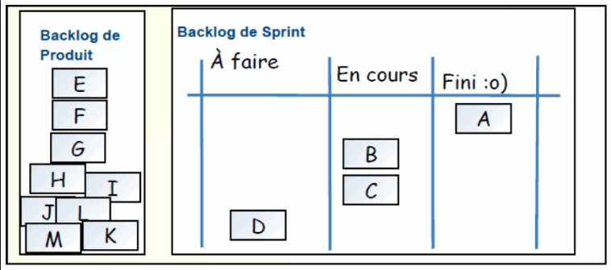
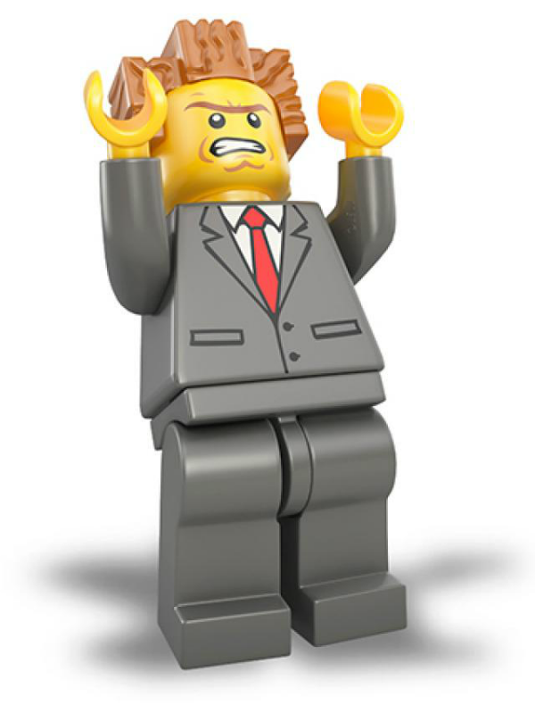

##LEGO FOR SCRUM

 		Description:

 		Le but de notre atelier est d'enseigner les méthodes agiles à un public varié afin d'être 
 		capable de gérer un travail de groupe que ce soit en entreprise ou à des fins personnelles. 
 		Ce descriptif a pour objectif de guider un formateur lambda sur le pilotage d'un atelier 
 		grâce à un procédé d'organisation à travers un jeu ludique que sont les lego. 
 		L'atelier peut intéresser tout les âges car il est accessible et
 		si facile de retomber en enfance avec un jeu qui a bercé notre jeunesse.

=>

		Nombre de participants :
		- 2 groupes de 4 personnes minimum
		- 20 personnes maximum

=>

		Présentation formation :

		Nous sommes 23 élèves de l'école du numérique alias la Fabrik mis en place par Face Bourbonnais.
		Notre formation dure 8 mois dont 2 mois de stage durant lesquels nous allons apprendre 
		différents languages informatiques afin de réaliser des sites internets.
		Nous sommes donc ici pour vous présenter une procédure que nous avons nous même appris
		pour mieux mettre en place un projet quelconque.
		Elles vous permettront d'apprendre le sens du partage de la collaboration mais aussi un savoir 
		être et des valeurs humaines indsipensables dans le monde de l'entreprise mais aussi pour 
		votre propre expérience.
		Cette façon de travail vous permet d'avoir une vue d'ensemble sur la progression du projet, 
		une flexibilité avec les échanges entre clients et collaborateurs et 
		une facilité de compréhension et modification.

=>
		
		Projet :

		Construire une ville à l'aide des lego pour un groupe et pour un autre groupe un parc 
		d'attraction.
		Le but étant que les deux projets puissent se réunir et former un ensemble harmonieux.
		Les groupes seront formés de minimum 3 personnes , dans ce groupe une personne sera scrum
		master c'est à dire chef de projet. Il devra diriger l'équipe et donner des instructions 
		simples afin d'organiser les tâches du groupe . Le projet étant à la base donné par les 
		formateurs et inscrit dans les backlogs.

=>

		Besoins matériels pour la formation legoForscrum :

 		- Des post-it
 		- Des stylos
 		- Un paperboard
 		- Des tables et des chaises 
 		- Des legos

=>

		Plan : 
    	Commencer par les présentations
    	Expliquez pourquoi la méthode agile est efficace
    	Description des outils que nous allons utiliser
    	Pourquoi les lego ?
    	Mise place des groupes et es plan de travail (feuille feutre lego)
    	Explication du tableau et exemple que nous allons utilisé (et pourquoi)
    	Mise en place d'un scrum dans chaque equipe
    	Mise en place du cahier des charges
    	Réalisation des backlogs dans chaque equipe suite à des échanges
    	Placement de post it dans les colonnes correspondantes
    	Explication du sprint
    	Entretien avec le client 
    	Finalisation des projets et merge des 2 constructions (parc et ville)

=>

		La définition de la méthode agile :

		- Permet le pilotage et la réalisation de projet tout en octroyant une grande réactivité par 
		  rapport aux demandes du client .
		- Établir un tableau pour l'organisation du jeu avec 4 colonnes => 

		- Backlog (à partir du cahier des charges)
		- To Do (ce qu'on à faire)
		- Wip (choses sur lesqueslles on travaille)
		- Done (élèments finis et approuvés par le client)
		- Le rôle du Scrum Master :

        Le Scrum Master est une déclinaison de chef de projet, ce terme vient
        du rugby du poste de demi mêlée.
        Ses responsabilitées sont d'aider l'équipe à travailler de façon autonome et à s'améliorer 
        constamment. 
        Il est garant du processus.Ses tâches sont d'organiser des réunions et animer le processus 
        d'un projet. 
        Il doit eliminer les obstacles qui surviennent rapidement tout en évitant le ralentisement 
        de l'équipe (protège l'equipe des interférences). Il fait en sorte que l'équipe reste concentrée 
        sur l'objectif, il réalise les élèments du Backlog avec l'équipe en collaboration étroite avec 
        le client. 
        Il met à jour régulièrement le tableau agile et créer des rapports du travail effectué.
		Points clés :
		Ce n'est pas un chef de projet : il ne dirige pas, il n'impose pas, il ne contraint pas.
		Il fait parti de l'équipe : il s'engage avec les autres.
		Il doit régulièrement rencontrer -physiquement- les autres membres de l'équipe, il ne reste pas 
		dans son bureau.

=>

		

		Le déroulement : 

		Le jeu sera divisé en plusieurs parties 
		1) Création des équipes et désignation d'un scrum (décrire rôle scrum)
		2) Cahier des charges dicté aux scrums : (3 bâtiments max donné au premier sprint)
		   Parc d'attraction:

			Le client demandera en terrain(dessin) des rails qui traverseront le parc 
			afin de se déplacer plus rapidement.
			Il pourra également si le groupe a oublié, ajouter un wagon/train.

			En batiment le client demandera par exemple: 
											 - Parc Aquatique
                                             - Un restaurant
                                             - Un manege.
                                             - ...........

			Il demandera également des contraintes:         
											 - Entré avec guichet
                                             - Un Motel
                                             - Un Parking
                                             - ...........
    
		   Ville:

			Le client demandera en terrain(dessin) une rivière qui coupera la ville en deux.
			Pourquoi pas rajouter des petits bateaux, le client laissera place à son imagination.

			En batiment le client demandera pas exemple: 
											 - Stade de foot
                                             - Ecole
                                             - Mairie
                                             - ..........

			Il demandera également des contraintes:      
											 - Des tribunes pour le stade
                                             - Des panneaux de signialisation, 
                                             - feux, stop, etc..
                                             - ..................
		3) Etablissement des backolgs =>
			Expliquer utilisation des post-it selon méthode agile
			Bien détailler chaque étape de la construction d'un bâtiment
		4) Partie de construction divisé en sprint de 7 minutes avec rendu obligatoire
		    du scrum au client. Ajout possible de nouveaux élèments de la part du client 
		    Un sprint est rassemblement de personnes impliquées dans un projet afin de se concentrer 
		    sur le développement de ce projet. Le temps des sprints seront determinées selon les projets.

